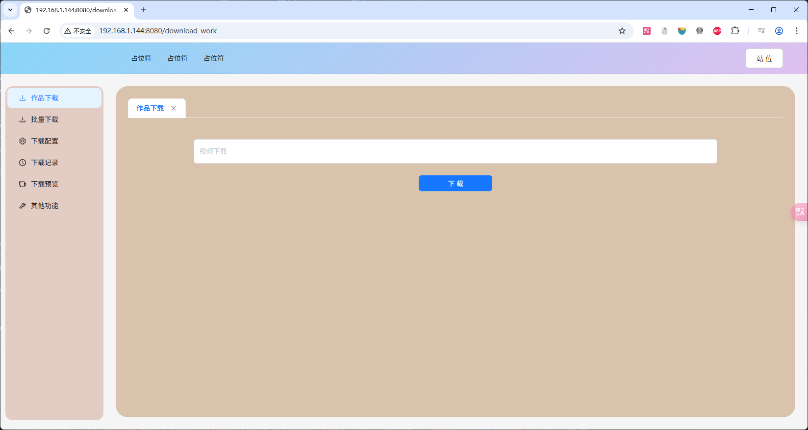
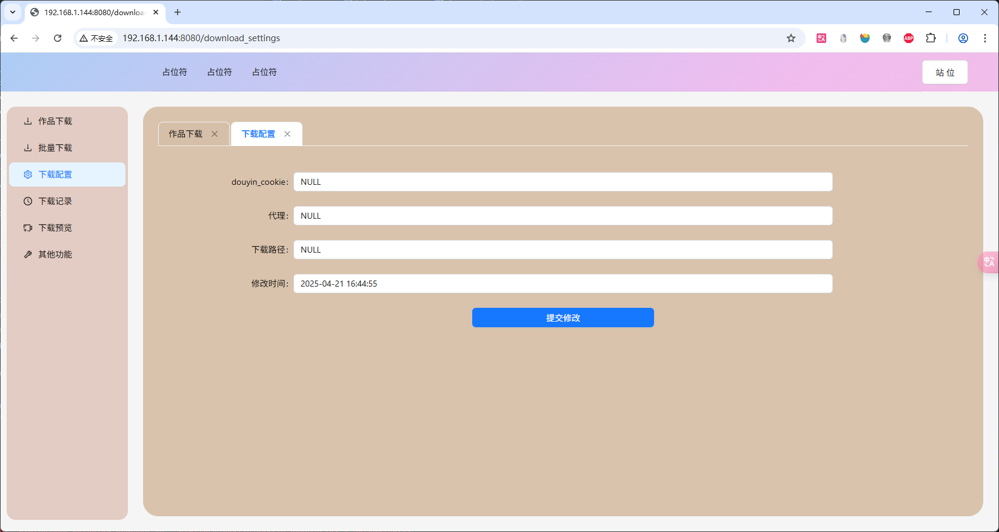
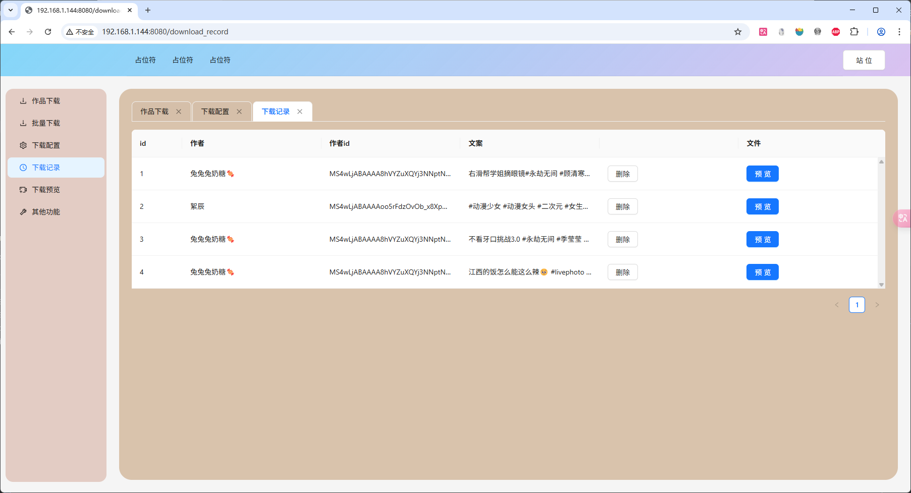
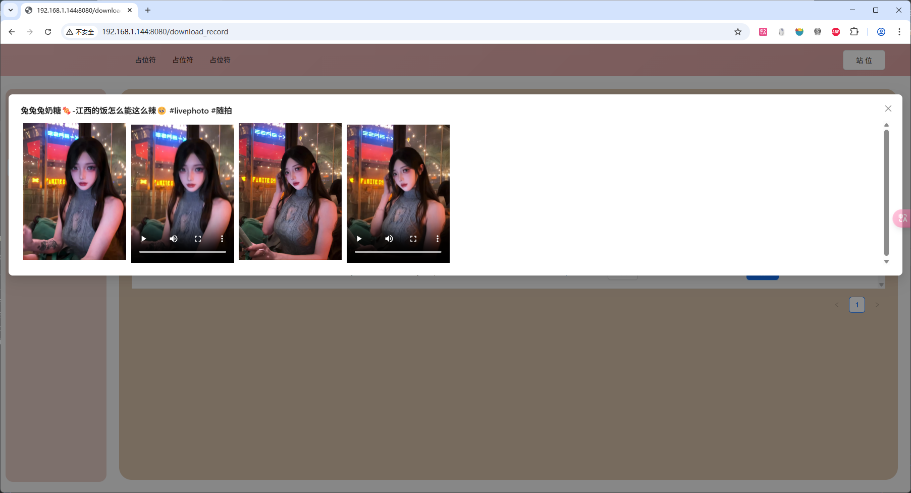
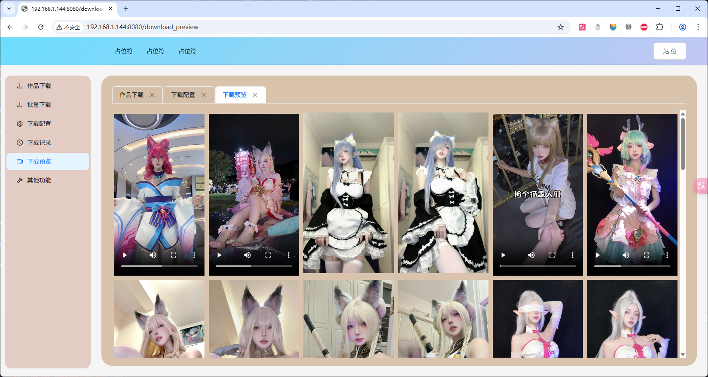

```
后台
    https://www.python.org/downloads/source/ 
    pip install -r requirements.txt
    python main.py
web
    https://nodejs.org/en
    cd web 
    npm install 
    npm run dev 
    目前支持
    _platform/douyin/douyin_detail              单视频
    _platform/douyin/douyin_post                用户主页
    _platform/douyin/douyin_live                直播
    _platform/bilibili/bilibili_live            直播
    _platform/bilibili/bilibili_detail          单视频
    
    支持在下载管理中暂停  直播/批量 下载
    
    
```







