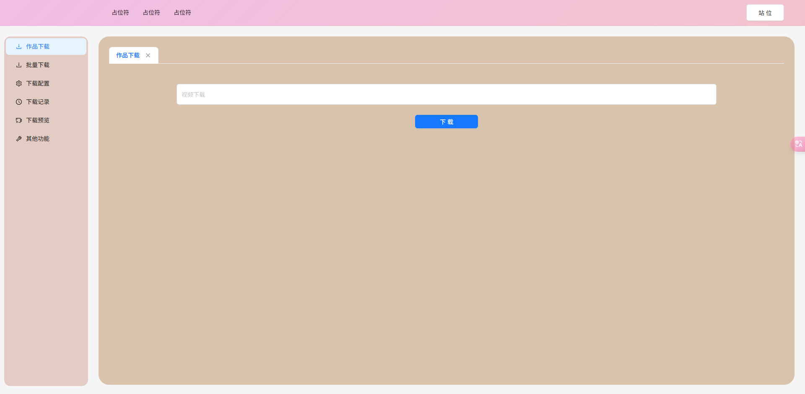
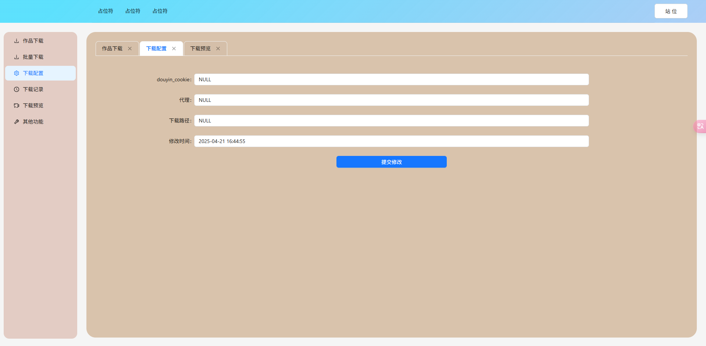
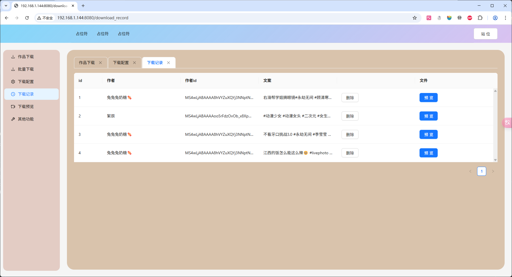
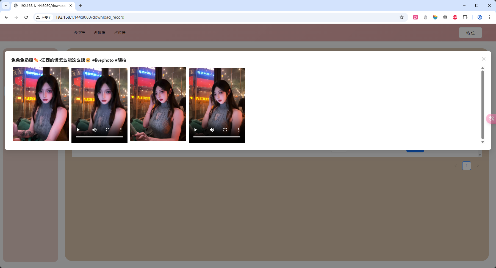
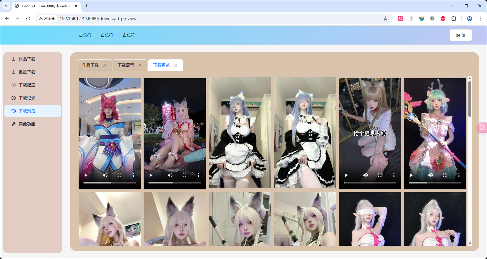

```
后台
    https://www.python.org/downloads/source/ 
    pip install -r requirements.txt
    python main.py
web
    https://nodejs.org/en
    cd web 
    npm install 
    npm run dev 
```







